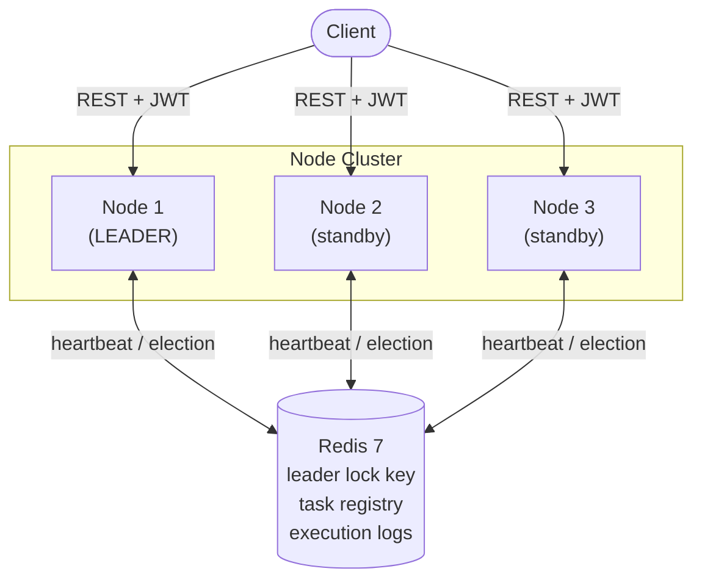
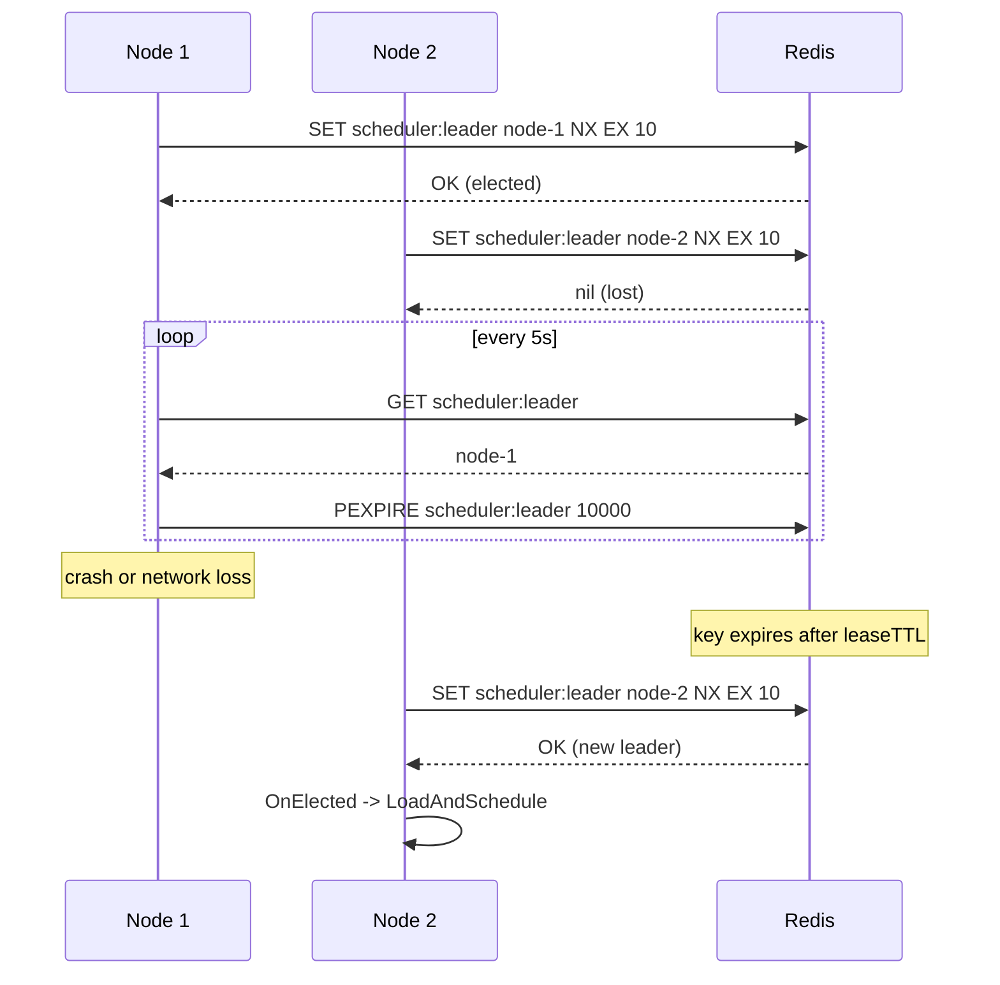
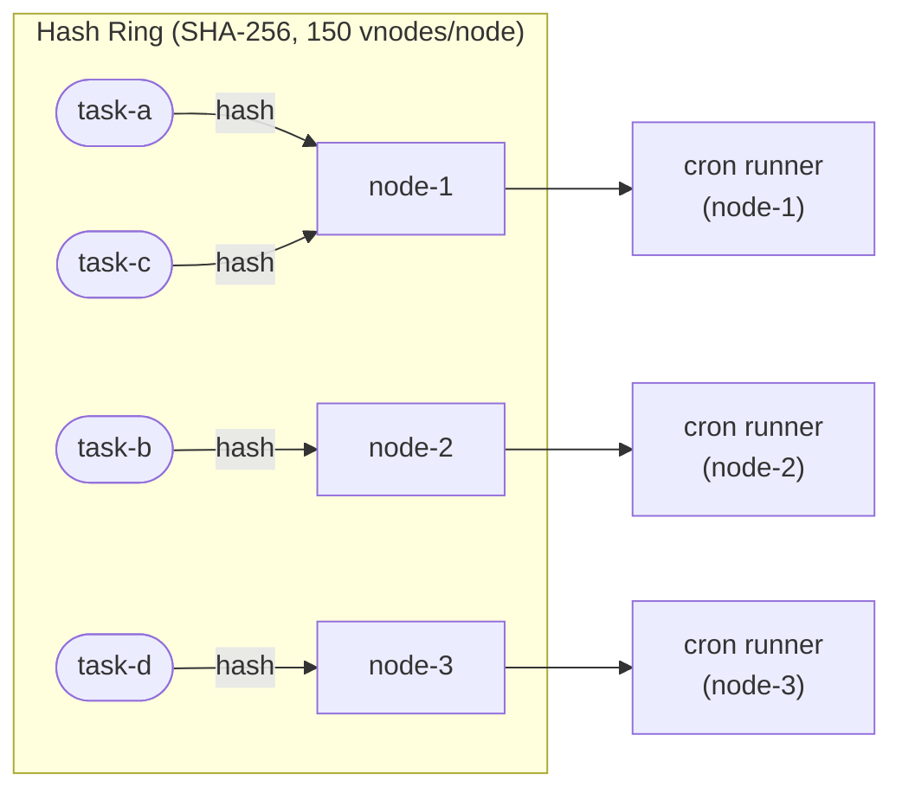
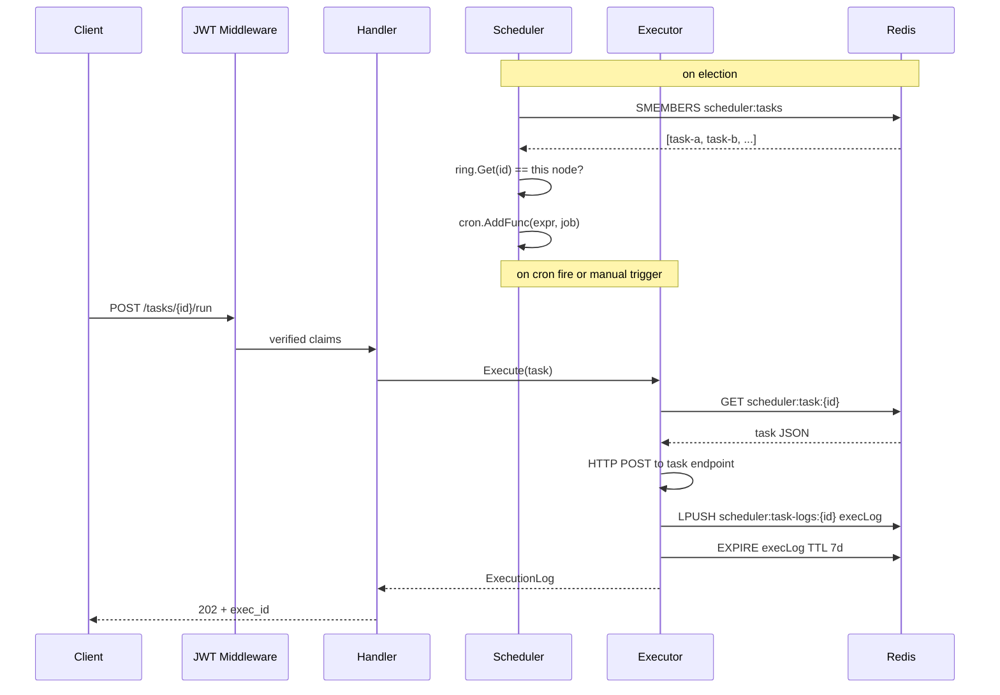

# Distributed Task Scheduler

A distributed cron-like task scheduler in Go. Tasks are registered with cron expressions, distributed across worker nodes using consistent hashing, and a single leader is elected via Redis-based heartbeat to prevent duplicate executions.



## Stack

| Layer | Technology |
|---|---|
| Language | Go 1.23 |
| HTTP | net/http + chi v5 |
| Scheduler | robfig/cron v3 |
| Coordination | Redis 7 (leader election + task registry) |
| Consistent Hashing | Custom SHA-256 ring with virtual nodes |
| Auth | JWT HS256 (golang-jwt/jwt v5) |
| Observability | Prometheus (prometheus/client_golang) |
| Containerization | Docker + Docker Compose |
| Testing | testing + testify + miniredis |

## Quick Start (Docker Compose)

```bash
git clone https://github.com/bit2swaz/task-scheduler
cd task-scheduler
cp .env.example .env          # edit JWT_SECRET before use
make docker-up                # starts 3 scheduler nodes + Redis + Prometheus
```

Verify the cluster:

```bash
# All three nodes respond
curl -s localhost:3001/health | jq .
curl -s localhost:3002/health | jq .
curl -s localhost:3003/health | jq .

# Exactly one node has is_leader: true
for port in 3001 3002 3003; do
  echo -n "node $port: "; curl -s localhost:$port/health | jq .is_leader
done

# Prometheus UI
open http://localhost:9090
```

Get a token and create a task:

```bash
TOKEN=$(curl -s -X POST localhost:3001/auth/token \
  -H "Content-Type: application/json" \
  -d '{"node_id":"demo","secret":"change-me-before-use"}' | jq -r .token)

curl -s -X POST localhost:3001/tasks \
  -H "Authorization: Bearer $TOKEN" \
  -H "Content-Type: application/json" \
  -d '{"name":"ping","cron_expr":"* * * * *","endpoint":"http://httpbin.org/post","enabled":true}' | jq .
```

## Local Development

**Prerequisites:** Go 1.23+, Redis 7 running locally.

```bash
# copy env, edit as needed
cp .env.example .env

# run a single node
make run

# unit tests
make test

# unit tests with race detector
make test-race

# integration tests (uses miniredis, no live Redis needed)
make test-integration
```

## Running Tests

| Command | What it runs |
|---|---|
| `make test` | Unit tests across all packages |
| `make test-race` | Unit tests with `-race` detector |
| `make test-integration` | Integration suite (`-tags integration`) |
| `make lint` | `golangci-lint run` |

## Environment Variables

| Variable | Type | Default | Required | Description |
|---|---|---|---|---|
| `PORT` | string | `3000` | no | HTTP listen port |
| `NODE_ID` | string | | yes | Unique identifier for this node |
| `REDIS_URL` | string | `redis://localhost:6379` | no | Redis connection URL |
| `JWT_SECRET` | string | | yes | Secret used to sign and verify JWTs |
| `HASH_RING_REPLICAS` | int | `150` | no | Virtual nodes per physical node in the hash ring |
| `LEASE_TTL` | duration | `10s` | no | How long the leader key lives before expiry |
| `RENEW_INTERVAL` | duration | `5s` | no | How often the leader renews its lease |
| `POLL_INTERVAL` | duration | `5s` | no | How often standby nodes attempt election |

## Architecture

### Leader Election

Each node races to set `scheduler:leader = <node_id>` in Redis using `SET NX EX <leaseTTL>`. Only one node wins. The winner renews the key every `pollInterval`; if it fails to renew (crash, network partition) the key expires and a standby acquires it within `leaseTTL + pollInterval` (at most 15 seconds with defaults). Callbacks `OnElected` / `OnEvicted` wire directly into the scheduler start/stop lifecycle.



### Consistent Hashing

Task IDs are hashed onto a ring of virtual nodes (150 replicas per physical node by default) using SHA-256. `ring.Get(taskID)` returns the responsible node via binary search with wrap-around. Each node only schedules and executes tasks assigned to it. When nodes join or leave, only the tasks that fall on the moved arc of the ring are reassigned; the rest are unaffected.



### Task Dispatch

The leader loads all tasks from Redis on election, filters to those assigned to this node via the ring, and registers them with `robfig/cron`. Cron fires execute an HTTP POST to the task endpoint and write a structured `ExecutionLog` (with TTL 7 days) to Redis. Manual triggers bypass cron and call the executor directly.



## API Reference

See [docs/API.md](docs/API.md) for the full endpoint reference with request/response schemas and `curl` examples.

## Architecture Decision Records

- [ADR-001 Redis leader election](docs/adr/ADR-001-redis-leader-election.md)
- [ADR-002 Consistent hashing](docs/adr/ADR-002-consistent-hashing.md)
- [ADR-003 Chi router](docs/adr/ADR-003-chi-router.md)
- [ADR-004 JWT auth](docs/adr/ADR-004-jwt-auth.md)

## Runbooks

- [Leader failover](docs/runbooks/runbook-leader-failover.md)
- [Scaling: adding a new node](docs/runbooks/runbook-scaling.md)
- [Task execution debugging](docs/runbooks/runbook-task-debugging.md)

## Project Layout

```
task-scheduler/
├── cmd/scheduler/main.go           # bootstrap: config, wiring, graceful shutdown
├── internal/
│   ├── config/config.go            # env-based config with defaults
│   ├── election/leader.go          # Redis SET NX EX + renewal
│   ├── hashring/ring.go            # consistent hash ring, virtual nodes
│   ├── registry/task_registry.go   # task CRUD + node membership in Redis
│   ├── scheduler/scheduler.go      # robfig/cron wrapper, ring-filtered dispatch
│   ├── executor/executor.go        # HTTP POST, execution log, 7-day TTL
│   ├── api/handler.go              # chi handlers for all REST endpoints
│   ├── api/middleware.go           # JWT middleware, request-id propagation
│   └── metrics/metrics.go          # Prometheus counters, histograms, gauges
├── docker/
│   ├── Dockerfile                  # multi-stage build (golang:1.23-alpine + alpine:3.19)
│   ├── docker-compose.yml          # 3-node cluster + Redis + Prometheus
│   └── prometheus.yml              # scrape config
├── tests/
│   └── integration_test.go         # 10 end-to-end scenarios (build tag: integration)
├── docs/
│   ├── SSOT.md
│   ├── ROADMAP.md
│   ├── API.md
│   ├── adr/
│   └── runbooks/
├── .env.example
└── Makefile
```
