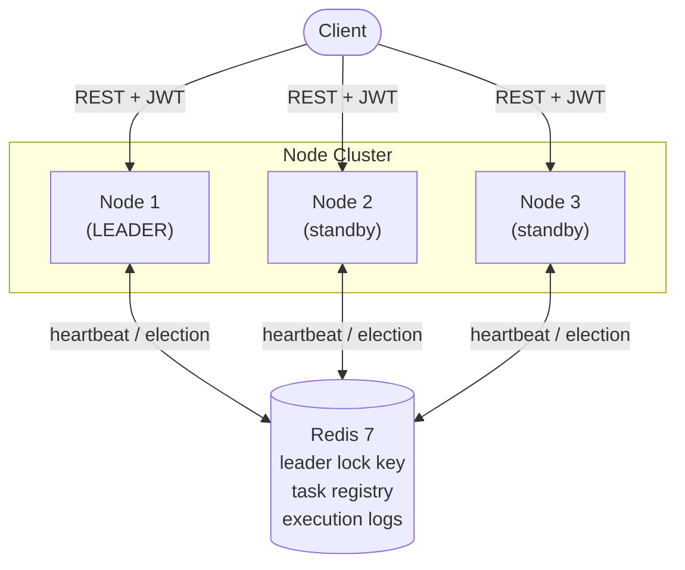
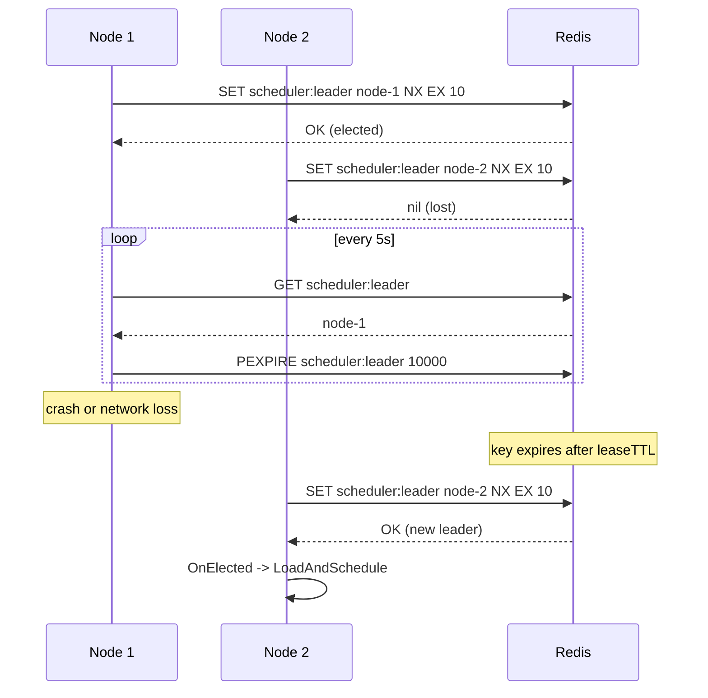
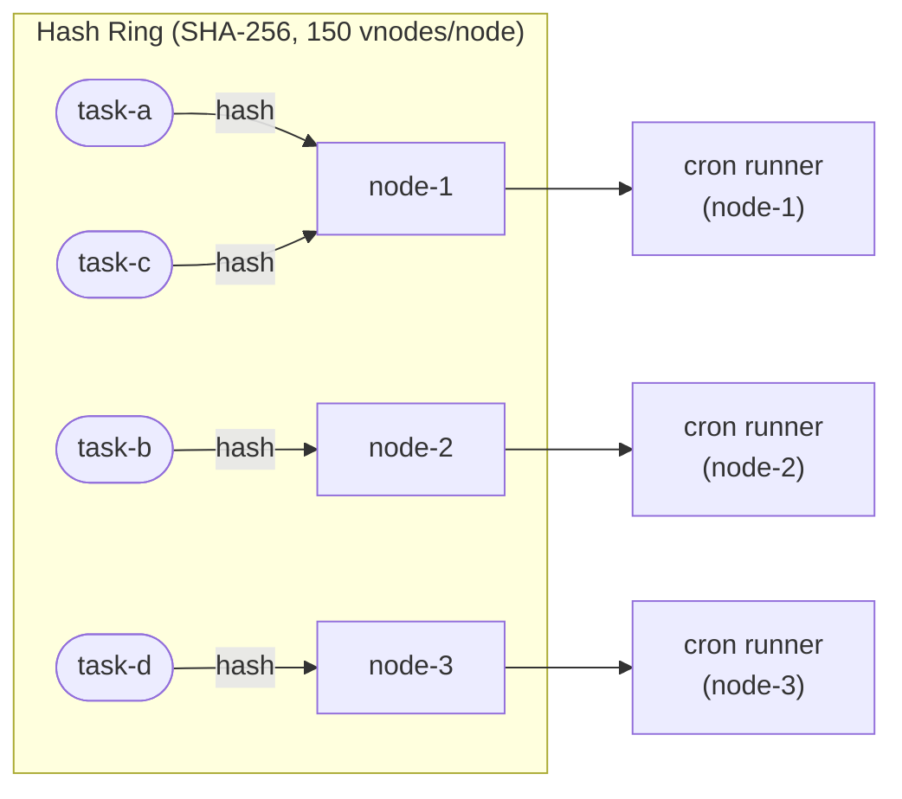
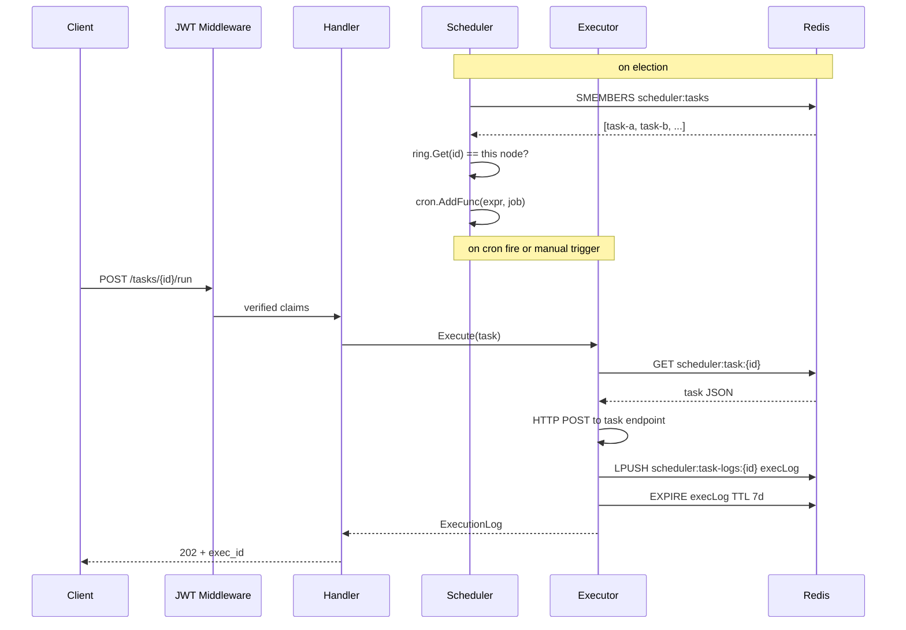

# Distributed Task Scheduler (Go)

## Overview
A distributed cron-like task scheduler in Go. Supports registering tasks with cron expressions, distributes execution across worker nodes using consistent hashing, and elects a leader via heartbeat-based leader election. Fully observable via Prometheus, containerized with Docker Compose.

## Stack
| Layer | Tech |
|---|---|
| Language | Go 1.22 |
| HTTP | net/http + chi router |
| Scheduler | robfig/cron v3 |
| Coordination | Redis 7 (leader election + task registry) |
| Consistent Hashing | Custom implementation (jump hash or hashring) |
| Auth | JWT (github.com/golang-jwt/jwt) |
| Observability | Prometheus (prometheus/client_golang) |
| Containerization | Docker + Docker Compose |
| Testing | testing + testify |

## Architecture

### Cluster Topology



### Leader Election Flow



## Consistent Hashing (Task to Node Assignment)



## Directory Structure

```
task-scheduler/
├── cmd/
│   └── scheduler/
│       └── main.go              # Bootstrap: flags, config, start node
├── internal/
│   ├── election/
│   │   └── leader.go            # Redis-based leader election (SET NX EX + renewal)
│   ├── scheduler/
│   │   ├── scheduler.go         # robfig/cron wrapper, task dispatch
│   │   └── cron.go              # Cron expression validation helpers
│   ├── hashring/
│   │   └── ring.go              # Consistent hash ring implementation
│   ├── registry/
│   │   └── task_registry.go     # Task CRUD in Redis, node membership
│   ├── executor/
│   │   └── executor.go          # Executes task (HTTP call / shell cmd / Go func)
│   ├── api/
│   │   ├── handler.go           # chi HTTP handlers
│   │   └── middleware.go        # JWT auth, logging, request ID
│   ├── metrics/
│   │   └── metrics.go           # Prometheus counters/histograms
│   └── config/
│       └── config.go            # Env-based config with defaults
├── docker/
│   ├── Dockerfile
│   └── docker-compose.yml
├── tests/
│   ├── election_test.go
│   ├── hashring_test.go
│   └── scheduler_test.go
├── .env.example
└── README.md
```

## Core Implementation Details

### 1. Leader Election
```go
// internal/election/leader.go
package election

import (
    "context"
    "time"
    "github.com/redis/go-redis/v9"
)

const (
    leaderKey   = "scheduler:leader"
    leaseTTL    = 10 * time.Second
    renewInterval = 5 * time.Second
    pollInterval  = 5 * time.Second
)

type LeaderElector struct {
    rdb    *redis.Client
    nodeID string
    isLeader bool
    onElected  func()
    onEvicted  func()
}

func (e *LeaderElector) Run(ctx context.Context) {
    ticker := time.NewTicker(pollInterval)
    defer ticker.Stop()

    for {
        select {
        case <-ctx.Done():
            return
        case <-ticker.C:
            if e.isLeader {
                e.renew(ctx)
            } else {
                e.tryElect(ctx)
            }
        }
    }
}

func (e *LeaderElector) tryElect(ctx context.Context) {
    ok, err := e.rdb.SetNX(ctx, leaderKey, e.nodeID, leaseTTL).Result()
    if err != nil || !ok {
        return
    }
    e.isLeader = true
    e.onElected()  // Start scheduler on this node
}

func (e *LeaderElector) renew(ctx context.Context) {
    // Only renew if we still own the key
    val, err := e.rdb.Get(ctx, leaderKey).Result()
    if err != nil || val != e.nodeID {
        e.isLeader = false
        e.onEvicted()  // Another node took over
        return
    }
    e.rdb.Expire(ctx, leaderKey, leaseTTL)
}
```

### 2. Consistent Hash Ring
```go
// internal/hashring/ring.go
package hashring

import (
    "crypto/sha256"
    "encoding/binary"
    "sort"
    "sync"
)

type Ring struct {
    mu       sync.RWMutex
    replicas int               // virtual nodes per physical node
    ring     map[uint64]string // hash → nodeID
    sorted   []uint64          // sorted keys for binary search
}

func New(replicas int) *Ring {
    return &Ring{replicas: replicas, ring: make(map[uint64]string)}
}

func (r *Ring) Add(nodeID string) {
    r.mu.Lock()
    defer r.mu.Unlock()
    for i := 0; i < r.replicas; i++ {
        h := hash(fmt.Sprintf("%s:%d", nodeID, i))
        r.ring[h] = nodeID
        r.sorted = append(r.sorted, h)
    }
    sort.Slice(r.sorted, func(i, j int) bool { return r.sorted[i] < r.sorted[j] })
}

func (r *Ring) Get(key string) string {
    r.mu.RLock()
    defer r.mu.RUnlock()
    h := hash(key)
    // Binary search for first ring position >= h
    idx := sort.Search(len(r.sorted), func(i int) bool { return r.sorted[i] >= h })
    if idx == len(r.sorted) {
        idx = 0  // wrap around
    }
    return r.ring[r.sorted[idx]]
}

func hash(key string) uint64 {
    h := sha256.Sum256([]byte(key))
    return binary.BigEndian.Uint64(h[:8])
}
```

### 3. Task Registry & Scheduler
```go
// internal/registry/task_registry.go
// Tasks stored in Redis as JSON:
// scheduler:task:{id} → { id, name, cronExpr, endpoint, payload, enabled }

type Task struct {
    ID       string `json:"id"`
    Name     string `json:"name"`
    CronExpr string `json:"cron_expr"`   // e.g. "0 * * * *" = hourly
    Endpoint string `json:"endpoint"`    // HTTP endpoint to call
    Payload  string `json:"payload"`     // JSON body to POST
    Enabled  bool   `json:"enabled"`
}

// internal/scheduler/scheduler.go
type Scheduler struct {
    cron     *cron.Cron
    registry *registry.TaskRegistry
    executor *executor.Executor
    ring     *hashring.Ring
    nodeID   string
}

func (s *Scheduler) LoadAndSchedule(ctx context.Context) error {
    tasks, err := s.registry.ListAll(ctx)
    for _, task := range tasks {
        task := task  // capture for closure
        // Only schedule tasks assigned to this node
        if s.ring.Get(task.ID) != s.nodeID {
            continue
        }
        s.cron.AddFunc(task.CronExpr, func() {
            s.executor.Execute(ctx, task)
        })
    }
    s.cron.Start()
    return nil
}
```

### 4. Executor

#### Task Dispatch Flow



```go
// internal/executor/executor.go
// Executes a task by POSTing to its endpoint, logs result to Redis

func (e *Executor) Execute(ctx context.Context, task registry.Task) {
    start := time.Now()
    execID := uuid.New().String()

    resp, err := http.Post(task.Endpoint, "application/json",
        strings.NewReader(task.Payload))

    duration := time.Since(start)
    status := "success"
    if err != nil || resp.StatusCode >= 400 {
        status = "failed"
        tasksFailed.With(prometheus.Labels{"task": task.Name}).Inc()
    } else {
        tasksExecuted.With(prometheus.Labels{"task": task.Name}).Inc()
    }

    // Log execution to Redis (TTL 7d)
    e.rdb.Set(ctx, fmt.Sprintf("scheduler:exec:%s", execID), ExecutionLog{
        TaskID: task.ID, ExecID: execID,
        Status: status, Duration: duration.Milliseconds(),
        ExecutedAt: time.Now(), ExecutedBy: e.nodeID,
    }, 7*24*time.Hour)
}
```

### 5. REST API
```go
// internal/api/handler.go (chi router)

// Routes:
// POST   /tasks           → Register new task
// GET    /tasks           → List all tasks
// GET    /tasks/{id}      → Get task
// PUT    /tasks/{id}      → Update task
// DELETE /tasks/{id}      → Delete task
// POST   /tasks/{id}/run  → Trigger task immediately
// GET    /tasks/{id}/logs → Execution history
// GET    /nodes           → Cluster node list + leader
// GET    /health          → Node health (leader status, tasks assigned)
// GET    /metrics         → Prometheus

// Example task payload:
// POST /tasks
// {
//   "name": "daily-report",
//   "cron_expr": "0 9 * * *",
//   "endpoint": "http://report-service/generate",
//   "payload": "{\"format\": \"pdf\"}"
// }
```

### 6. Prometheus Metrics
```go
// internal/metrics/metrics.go
var (
    tasksExecuted = promauto.NewCounterVec(prometheus.CounterOpts{
        Name: "scheduler_tasks_executed_total",
        Help: "Total tasks executed successfully",
    }, []string{"task"})

    tasksFailed = promauto.NewCounterVec(prometheus.CounterOpts{
        Name: "scheduler_tasks_failed_total",
        Help: "Total task executions that failed",
    }, []string{"task"})

    taskDuration = promauto.NewHistogramVec(prometheus.HistogramOpts{
        Name:    "scheduler_task_duration_seconds",
        Help:    "Task execution duration",
        Buckets: prometheus.DefBuckets,
    }, []string{"task"})

    isLeader = promauto.NewGauge(prometheus.GaugeOpts{
        Name: "scheduler_is_leader",
        Help: "1 if this node is the current leader, 0 otherwise",
    })
)
```

### 7. Docker Compose (3-node cluster)
```yaml
# docker/docker-compose.yml
version: '3.9'

x-scheduler: &scheduler-base
  build: .
  environment:
    - REDIS_URL=redis://redis:6379
    - JWT_SECRET=${JWT_SECRET}
  depends_on:
    redis: { condition: service_healthy }

services:
  scheduler-1:
    <<: *scheduler-base
    ports: ["3001:3000"]
    environment:
      - NODE_ID=node-1
      - REDIS_URL=redis://redis:6379
      - JWT_SECRET=${JWT_SECRET}

  scheduler-2:
    <<: *scheduler-base
    ports: ["3002:3000"]
    environment:
      - NODE_ID=node-2
      - REDIS_URL=redis://redis:6379
      - JWT_SECRET=${JWT_SECRET}

  scheduler-3:
    <<: *scheduler-base
    ports: ["3003:3000"]
    environment:
      - NODE_ID=node-3
      - REDIS_URL=redis://redis:6379
      - JWT_SECRET=${JWT_SECRET}

  redis:
    image: redis:7-alpine
    ports: ["6379:6379"]
    healthcheck:
      test: ["CMD", "redis-cli", "ping"]
      interval: 5s
      retries: 5
    volumes:
      - redis_data:/data

  prometheus:
    image: prom/prometheus:latest
    volumes:
      - ./prometheus.yml:/etc/prometheus/prometheus.yml
    ports: ["9090:9090"]

volumes:
  redis_data:
```

## API Reference

| Method | Endpoint | Auth | Description |
|---|---|---|---|
| POST | /auth/token | none | Issue JWT |
| POST | /tasks | JWT | Register task with cron expression |
| GET | /tasks | JWT | List all tasks + assigned node |
| PUT | /tasks/:id | JWT | Update task |
| DELETE | /tasks/:id | JWT | Delete task |
| POST | /tasks/:id/run | JWT | Manual trigger |
| GET | /tasks/:id/logs | JWT | Execution history |
| GET | /nodes | JWT | Cluster nodes + current leader |
| GET | /health | none | Node health |
| GET | /metrics | none | Prometheus metrics |

## Environment Variables
```env
PORT=3000
NODE_ID=node-1
REDIS_URL=redis://localhost:6379
JWT_SECRET=your-secret
HASH_RING_REPLICAS=150
```

## Resume Bullet Points (copy-paste ready)
- Built a distributed cron-like task scheduler in Go with Redis-based leader election (SET NX EX + heartbeat renewal) ensuring exactly-one scheduler active across a multi-node cluster
- Implemented consistent hash ring for deterministic task-to-node assignment, automatically rebalancing when nodes join or leave the cluster
- Exposed REST API (chi) for task registration (cron expressions), manual triggers, and execution history; secured with JWT middleware
- Instrumented task execution (count, failure rate, duration) via Prometheus; containerized 3-node cluster with Docker Compose
